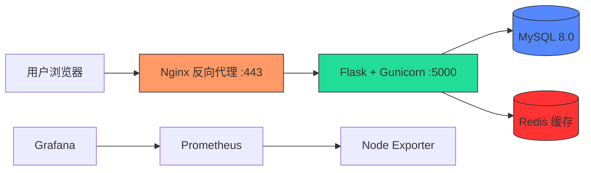

## 🛠️ 技术栈
| 类别 | 技术 | 说明 |
|------|------|------|
| 系统与云 | Alibaba Cloud Linux / CentOS 7 | ECS 服务器，安全组、iptables 防火墙配置 |
| Web 框架 | Flask + Gunicorn | RESTful API，生产级 WSGI 服务器 |
| Web 服务器 | Nginx | 反向代理、HTTPS、负载均衡 |
| 数据库 | MySQL 8.0 | 用户权限管理，备份恢复 |
| 缓存 | Redis | 缓存加速，空值防穿透，降低接口延迟 60%+ |
| 容器化 | Podman / Docker | 镜像构建，容器管理，docker-compose 一键启动 |
| 容器编排 | Kubernetes（本地集群） | Deployment/Service YAML 编写，Pod 管理验证 |
| 自动化部署 | Ansible | Playbook 实现代码拉取、构建、部署全流程 |
| 监控体系 | Prometheus + Node Exporter + Grafana | 服务器监控、仪表板、告警 |
| 脚本自动化 | Shell + Crontab | MySQL 备份、容器监控、日志清理 |
---
## 🏗️ 系统架构

### 模块说明
Web 服务
Flask 应用提供 /api/* 接口及 /logs 日志查看路由。
Gunicorn 多进程启动，Nginx 反向代理并强制 HTTPS。
数据库与缓存
MySQL 存储用户数据，每日凌晨自动备份（保留 7 天）。
Redis 实现查询缓存与防穿透策略，响应时间从 150ms 降至 5ms（缓存命中）。
容器化与编排
Dockerfile 构建应用镜像；docker-compose 编排 MySQL、Redis、Flask、Nginx。
Kubernetes：编写 Deployment（2副本）+ NodePort（30080）YAML，并在本地集群验证。
自动化部署
ansible/init-server.yml 使用 raw 模块解决 Python2 依赖问题，幂等执行，适合生产环境更新。
监控与自动化脚本
Prometheus + Grafana 监控 CPU、内存、磁盘、网络，配置告警阈值。
Shell 脚本配合 Crontab 实现自动化备份、容器自愈、日志清理。
详细踩坑记录见 CHANGELOG.md
## ☸️ Kubernetes 编排验证

编写了 Deployment + Service YAML（见 `k8s/k8s-demo.yaml`），在本地 Docker Desktop K8s 集群中部署 Nginx 应用：

- **Deployment**：定义 2 个副本，保证高可用
- **Service**：通过 NodePort 30080 暴露服务

验证了 Pod 调度、副本控制、Service 发现等核心概念。
